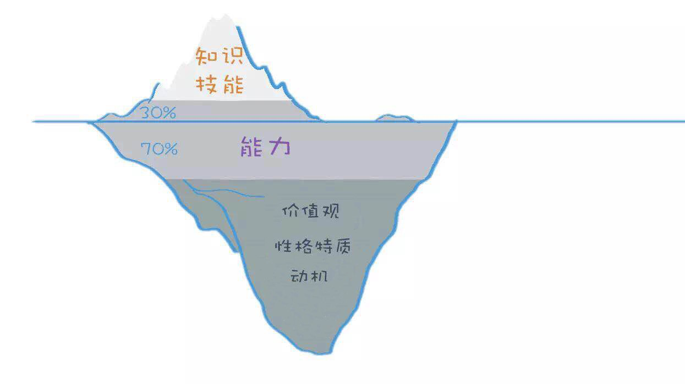

刚工作发现不喜欢想转行、到了新岗位发现不胜任想提升、人到中年发现这个工作的天花板很低……要么是我们现在的状态、要么是曾经有过的状态，这是正常不过的状态了，因为我们对自己的未来有期许，但当下的工作可能无法承载这样的期许，所以会觉得不喜欢、很迷茫。

最近学习了一个"冰山模型（Iceberg Model）"，我认为可以用来分析自己跟工作的匹配度，分析现在的工作或者将要转行的工作是不是自己喜欢并且会有成就感的工作。

冰山模型是美国著名心理学家麦克利兰于1973年提出了一个著名的模型。冰山模型将个人竞争力氛围分为三大类要素：知识技能类、通用能力类、天赋类。同时，分为可见的、表面的冰山以上部分和不可见的、深藏的冰山以下部分。

**第一类，知识技能类**

知识，是指我们对于对某特定领域的了解，比如财务知识、文学知识、管理知识。

技能，是指我们所具备的某项专门的技术，比如游泳、使用Excel、使用PS。

**第二类，通用能力类**

通用能力，比如思考能力、创新能力、人际交往能力等。它与知识技能的区别在于，知识技能是分领域的，而通用能力，是任何领域都可以用到的。通用能力是难以用一个证书或者题目进行考察的，只能通过观察他处理事情的行为去考察，所以通用能力的30%是可见的，处于冰山之上，而70%是不可见的，处于冰山之下。

**第三类，天赋类**

天赋类，是指个人的价值观、性格、动机等。

价值观，是指你看待事物的标准。比如说，你在择业时，自由和稳定产生了冲突，你选择什么？放弃什么？事业和家庭冲突时，你选择什么？放弃什么？

如果你在工作中经常陷入矛盾，对所做的事情不能发自内心的认同，很可能就是价值观不匹配。比如，你做自媒体，公司为了赚钱，让你写一些很标题党、伪养生之类的内容，但你觉得这对用户没有价值。

性格，是指个人的行为偏好。比如内向、外向，关注细节还是宏观。比如你是一个很内向的人，却做着一份天天需要主动同陌生人沟通的工作，这样即使工作内容不多，也会觉得很心累。

动机，根据麦克利兰的理论，分为成就动机、权利动机、亲和动机。成就动机的人，喜欢挑战，追求成就感；权利动机的人，希望能影响别人；亲和动机的人，希望维持良好的团队关系。比如你明明是亲和动机的人，但是你的工作内容是需要强势的去影响别人的，可能就会产生动机不匹配，导致工作没有干劲。

冰山下面的要素会影响上面的要素。举例来说，一个人的知识储备有多少，其实不仅取决于他看多少书，更重要的是他的学习能力、动机等等。学习和思考能力更强、并以追求真理作为价值观的人，知识储备会更高。

当我们感觉现在的工作不喜欢，就可以分析下，是因为知识技能的储备不足导致的焦虑，还是缺乏某种通用能力导致的挫败，还是价值观、性格、动机不匹配导致的矛盾。

对于成年人来说，天赋几乎是很难改变的，同时，越往冰山下面的部分越难培养，越难发现，当然也越能成为竞争优势。

通过这个模型，可以分析当前工作岗位或者目标工作岗位跟自己的匹配程度，找工作跟找伴侣一样，匹配比优秀更重要。

**我们该如何分析呢？**

1.分析目标岗位的冰山模型。

通过招聘网站，收集目标岗位的招聘需求，为了提取出共性需求，多收几分不同的招聘需求。

比如中级软件测试岗位，对于知识的要求：比如理工类专业、计算机相关专业、了解软件生命周期流程、熟悉软件测试理论及流程……

对于技能的要求：比如熟练使用Office办公软件，良好的文档编写能力、掌握sql语句、能看懂Java代码、使用Jmeter、会自动化测试、会小程序测试……

对于通用能力的要求：较强的分析问题以及解决问题的能力、良好的沟通能力和团队合作精神、学习能力强……

还有对价值观、性格特质的要求：比如认同公司的理念、细心、能接受加班……。

2.用目标岗位的冰山模型与自我的冰山模型做对比。

岗位的冰山模型已经出来了，那么就与自己的冰山模型对照一下，自己到底符不符合，是否应该换工作或者转行。当然我们很难找到完全匹配我们自我冰山模型的工作。如果是冰山模型的底层因素不匹配，那么就不大建议选择这个职业，因为这些后天因素对于成年人来说太难改变。但如果只是知识、技能不匹配，未必不能选，因为大部分知识、技能是可以后天学习的，就是看你是否愿意投入时间罢了。